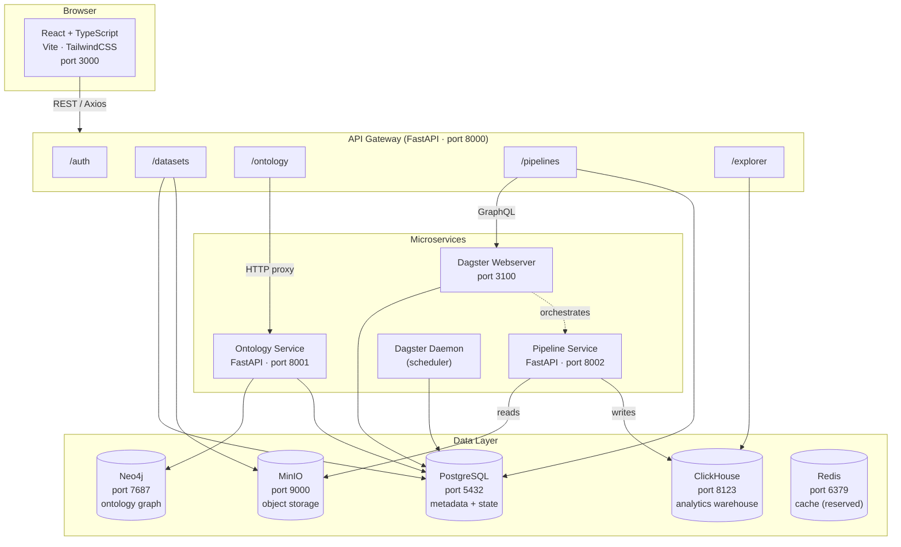
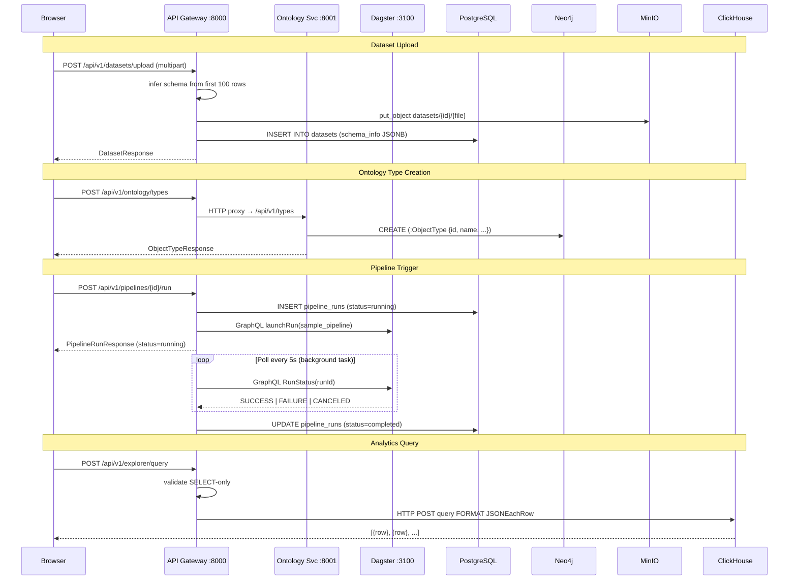
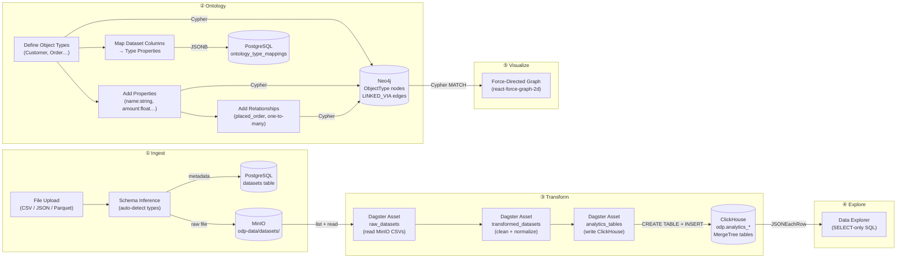
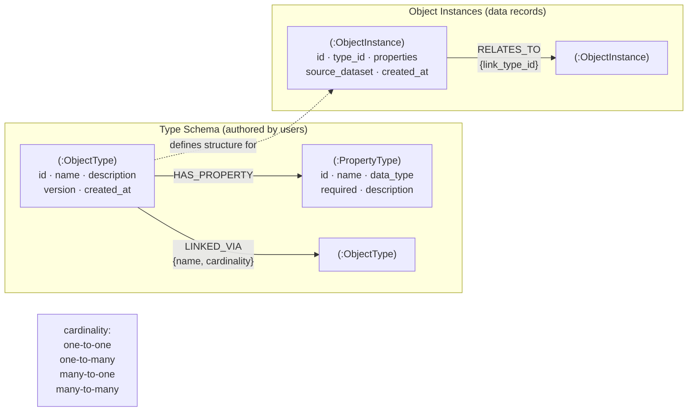
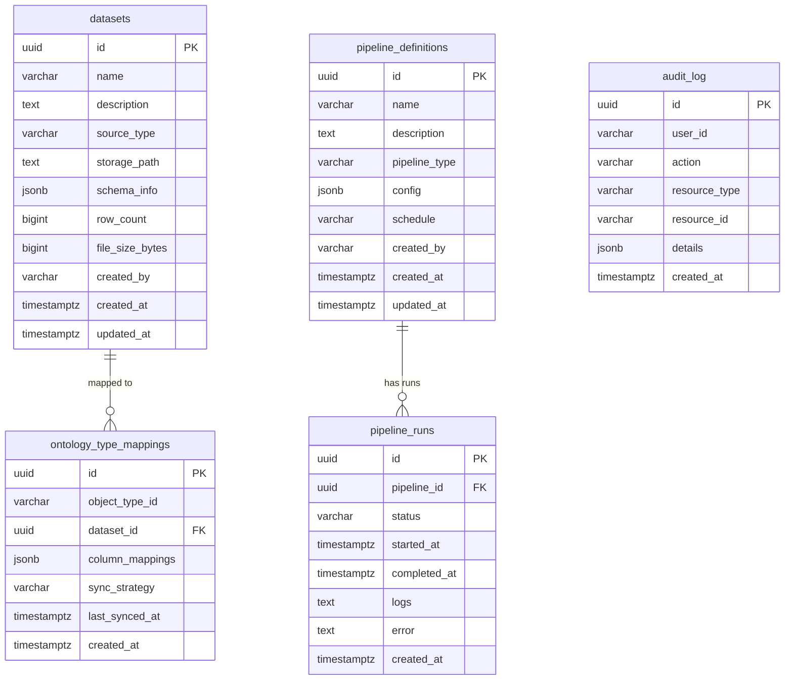
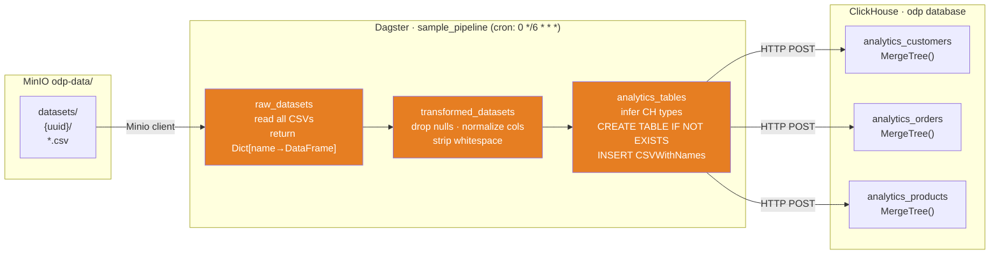
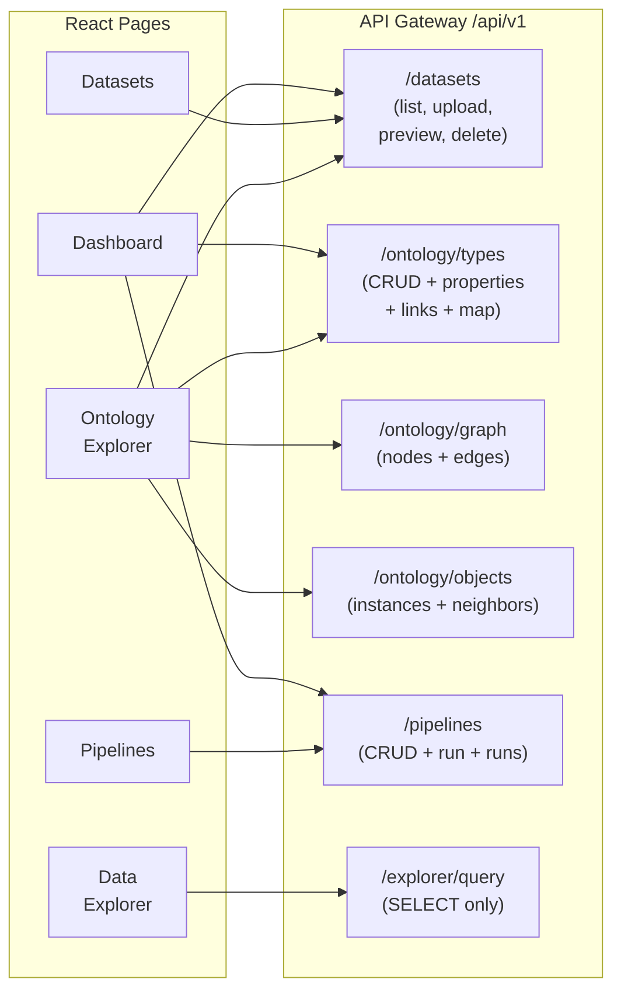
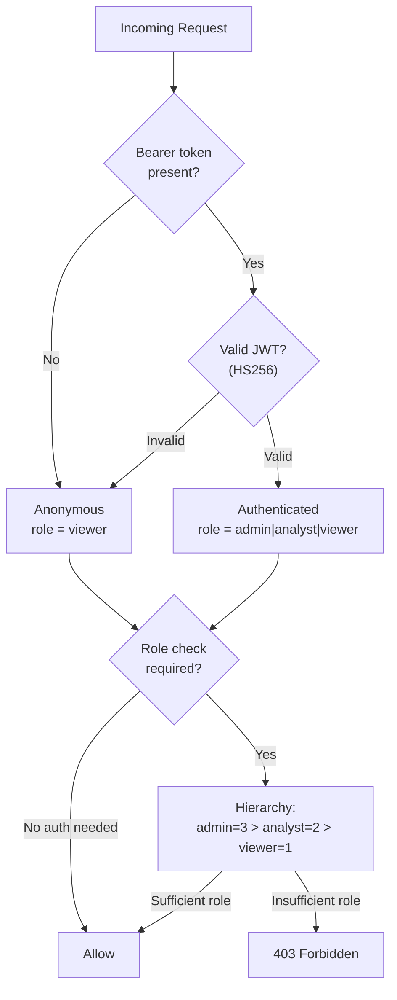
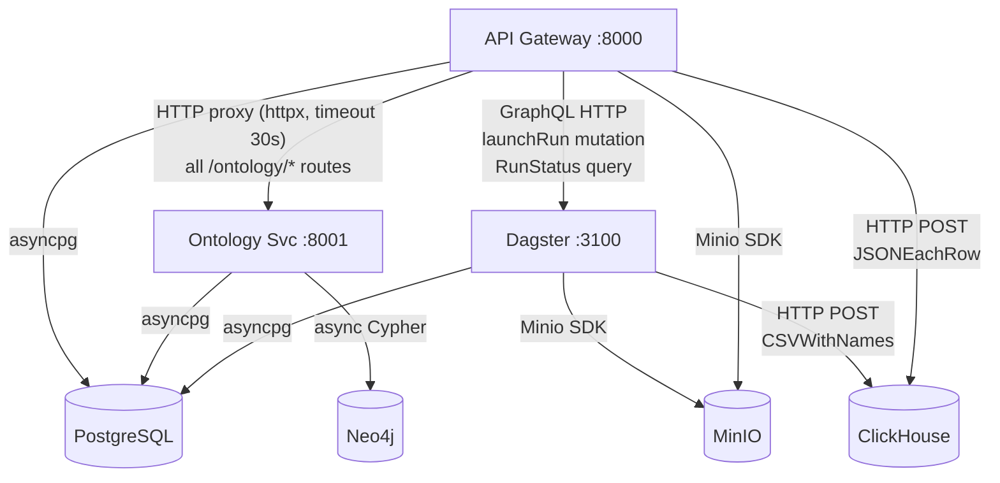
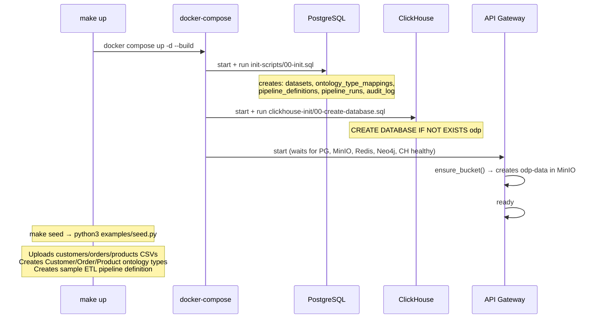

# ODP — Architecture Document

## Context

Open Data Platform (ODP) is a Phase 1 MVP for semantic data integration, transformation, and analytics. It connects disparate data sources to a semantic ontology layer, enables pipeline-based transformations, and provides SQL-based analytics. This document captures the current architecture as implemented.

---

## 1. System Overview

---

## 2. Request Routing

---

## 3. Data Flow — End to End

---

## 4. Neo4j Ontology Graph Model

---

## 5. PostgreSQL Schema

---

## 6. Dagster Pipeline DAG

---

## 7. Frontend Page → API Mapping

---

## 8. Authentication & Authorization

**Demo credentials:** `admin/admin` · `analyst/analyst` · `viewer/viewer`

---

## 9. Storage Responsibility Matrix

| Store | What lives there | Access pattern |
|---|---|---|
| **PostgreSQL** | Dataset metadata, pipeline definitions + runs, ontology-dataset mappings, audit log | Async/await via asyncpg pool (2–10 connections) |
| **Neo4j** | ObjectType nodes, PropertyType nodes, LINKED_VIA edges, ObjectInstance nodes, RELATES_TO edges | Async Cypher via neo4j-python-driver |
| **MinIO** | Raw uploaded files (`datasets/{uuid}/{filename}`) | S3-compatible SDK; read by Dagster asset |
| **ClickHouse** | Transformed analytics tables (`analytics_{name}`) | HTTP REST, JSONEachRow format |
| **Redis** | Reserved — configured but not yet used | — |

---

## 10. Inter-Service Communication

---

## 11. Key Design Decisions

| Decision | Rationale |
|---|---|
| API Gateway proxies to Ontology Service | Keeps ontology logic isolated; single ingress for clients |
| Neo4j for ontology | Natural fit for graph-shaped schema (types + relationships); Cypher traversal for neighbors |
| ClickHouse for analytics | Columnar, sub-second aggregations, MergeTree handles append-only analytics tables |
| MinIO for raw files | S3-compatible, runs locally, decoupled from DB |
| Dagster for orchestration | Software-defined assets model, built-in lineage, web UI for monitoring |
| dbt for transforms | SQL-native, self-documenting models, view/table materialization strategy |
| PostgreSQL for metadata | Relational integrity for pipeline runs + mappings; JSONB for flexible schemas |
| Async throughout | asyncpg + neo4j async driver + httpx — FastAPI handles concurrent requests efficiently |

---

## 12. Infrastructure Init

---

## Verification

To verify the full system after `make up && make seed`:

1. `curl http://localhost:8000/health` → `{"status":"healthy"}`
2. Upload a CSV → appears in Datasets page and MinIO bucket
3. Create an ObjectType in Ontology Explorer → node appears in force graph
4. Add a relationship → edge appears with label and animated particles
5. Trigger pipeline from Pipelines page → status transitions running → completed
6. Query `SELECT COUNT(*) FROM analytics_customers` in Data Explorer → returns row count
7. `curl http://localhost:8123/?database=odp&user=default&password=clickhouse_secret --data "SHOW TABLES"` → lists analytics_* tables
